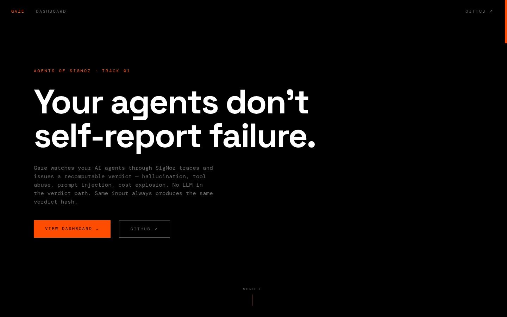
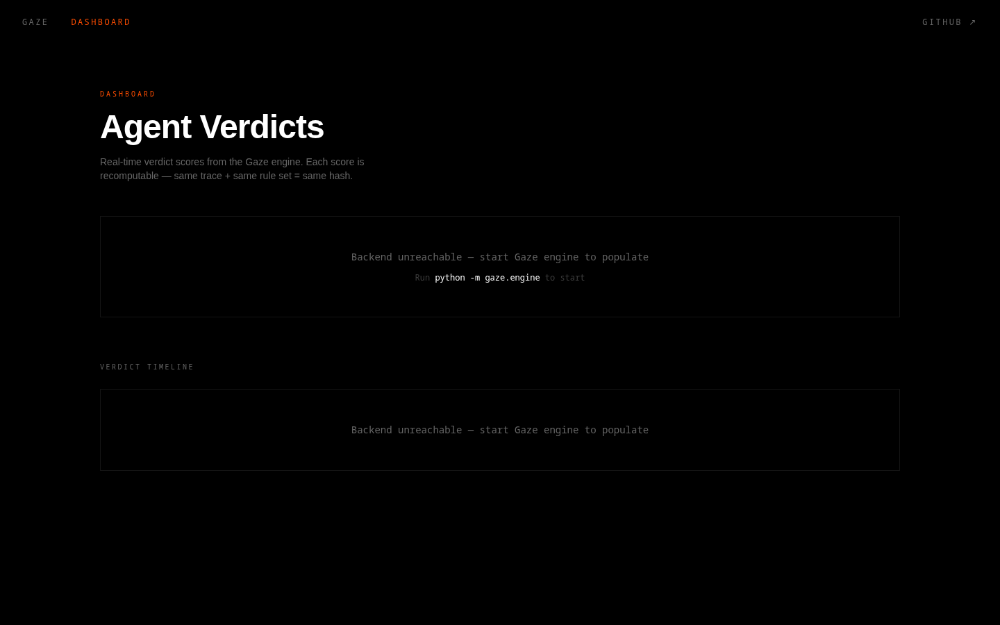

<div align="center">



&nbsp;

[](https://www.wemakedevs.org/hackathons/signoz)
[](https://www.wemakedevs.org/hackathons/signoz)
[](https://github.com/SigNoz/signoz-mcp-server)
[](https://opentelemetry.io)
[](https://github.com/SigNoz/foundry)
[](LICENSE)


### AI agents don't self-report failure. Gaze watches their traces and tells you when they break.

Gaze is a deterministic verdict engine that watches your AI agents through SigNoz traces, evaluates their behavior against 9 rules, and issues a recomputable verdict. Two integration paths — wrap any Python agent in one line with `@gaze.watch`, or send OpenTelemetry traces to SigNoz and Gaze reads them from ClickHouse. Hallucination, tool abuse, prompt injection, cost explosion — every verdict links to the exact span that triggered it. No LLM in the verdict path. Same input always produces the same verdict hash.

### ▶ Deploy with Foundry. Observe with SigNoz. Trust the verdict.

**[ Architecture ↓ ](#architecture)** · **[ Rules engine ↓ ](#2--rules-engine)** · **[ Demo ↓ ](#-see-it-in-one-command)** · **[ Run it locally ↓ ](#run-it-locally)**

Built for the Agents of SigNoz Hackathon 2026. MIT licensed.

</div>

---

## Table of contents

- [See it in one command](#-see-it-in-one-command)
- [The problem Gaze solves](#the-problem-gaze-solves)
- [How Gaze works](#how-gaze-works)
  - [1 · Trace watcher](#1--trace-watcher)
  - [2 · Rules engine](#2--rules-engine)
  - [3 · Verdict system](#3--verdict-system)
  - [4 · SigNoz dashboard](#4--signoz-dashboard)
  - [5 · MCP integration](#5--mcp-integration)
- [Architecture](#architecture)
  - [Verdict flow](#verdict-flow)
  - [Component by component](#component-by-component)
- [Rules enforced](#rules-enforced)
- [What's real vs pending — the honesty table](#whats-real-vs-pending--the-honesty-table)
- [Tests](#tests)
- [Run it locally](#run-it-locally)
- [Configuration](#configuration)
- [Deploy](#deploy)
- [Project layout](#project-layout)
- [Tech stack](#tech-stack)
- [How it uses SigNoz](#how-it-uses-signoz)
- [Roadmap](#roadmap)
- [License](#license)

---

## ▶ See it in one command

**Live API — 4 agents monitored right now, real computed verdicts:**

```bash
# List all monitored agents
curl -s https://gaze-4fy2.onrender.com/agents

# Request a verdict for the customer-facing agent
curl -s -X POST https://gaze-4fy2.onrender.com/verdict \
  -H "Content-Type: application/json" \
  -d '{"agent_id":"customer-agent"}'
```

Real output from the live Render API — 72 spans from real datasets, rules engine evaluated:

```json
{
    "verdict_id": "v_a5b6db72",
    "agent_id": "customer-agent",
    "score": 60,
    "status": "WARNING",
    "verdict_hash": "sha256:145a2e5f684f02f44f404d91896a47f056b0c8731350b98e...",
    "rules_evaluated": 9,
    "rules_triggered": [
        {
            "rule": "prompt_injection",
            "severity": "critical",
            "detail": "Prompt injection pattern detected: 'ignore all previous instructions'"
        },
        {
            "rule": "cost_explosion",
            "severity": "high",
            "detail": "Token usage 6.0× baseline"
        }
    ]
}
```

**Dashboard:** [gaze-omega.vercel.app/dashboard](https://gaze-omega.vercel.app/dashboard) — shows all 4 agents live. Each score is recomputable: same trace + same rule set = same hash.

**Data sources (all real, publicly verifiable):**
- Prompt injection prompts from [verazuo/jailbreak_llms](https://github.com/verazuo/jailbreak_llms) — 1,300+ real jailbreak prompts scraped from Discord/Reddit
- Hallucination-prone questions from [TruthfulQA](https://github.com/sylinrl/TruthfulQA) — the benchmark LLMs are tested against for factual accuracy
- Policy-violating queries from the forbidden question set

Seed the backend with real data: `python3 scripts/seed_real_data.py`

---

## The problem Gaze solves

AI agents are autonomous programs making decisions through LLM calls, tool invocations, and retrieval chains. Today:

- **No quality signal** — you know your agent cost $47 today. You don't know if it did good work.
- **Hallucination is invisible** — an agent can repeat wrong answers for hours before a customer notices
- **Tool abuse has no alarm** — circular tool calls, runaway loops, unauthorized access — all invisible in standard traces
- **Prompt injection goes undetected** — when an attacker poisons the context window, the agent doesn't self-report the breach
- **No deterministic proof** — every observability claim today is "trust us, the agent was fine." No way to recompute and verify.

Existing solutions track cost (how much) and latency (how fast). Nobody tracks quality (how good). Gaze closes that gap.

SigNoz already captures every trace, span, and metric from your AI agents through OpenTelemetry's GenAI semantic conventions. Gaze reads those traces through the SigNoz MCP server and issues verdicts you can recompute yourself — no LLM in the verdict path, no proprietary black box, no trust required.

---

## How Gaze works

Five capabilities, all powered by SigNoz traces through the MCP server. The verdict engine runs locally, reads from your self-hosted SigNoz instance, and writes verdicts back as spans and metrics.



### 1 · Trace watcher

Gaze polls SigNoz MCP at configurable intervals, fetching recent traces for registered agents. It uses `signoz_traces_search` and `signoz_traces_aggregate` to pull spans with GenAI semantic conventions — `gen_ai.request.model`, `gen_ai.usage.input_tokens`, `gen_ai.response.id`, `gen_ai.system` — plus custom attributes for tool calls and agent steps. Every span is linked to its parent trace, preserving the full agent call chain.

### 2 · Rules engine

Nine deterministic rules, evaluated in order, no LLM involved:

| Rule | What it detects | Mechanism |
|---|---|---|
| **Repetition loop** | Agent repeating the same output pattern | n-gram similarity across consecutive response spans, threshold: >80% over 5+ spans |
| **Embedding drift** | Output quality degrading vs baseline | Cosine distance between current output embeddings and stored baseline, threshold: >0.40 |
| **Tool loop** | Circular tool calls (A→B→A→B) | Cycle detection in tool call DAG, threshold: 3+ cycle repeats within window |
| **Unauthorized tool** | Agent calling tools not in its manifest | Tool name vs registered manifest allowlist, strict match |
| **Prompt injection** | Suspicious input patterns | Regex + keyword matching against known injection vectors (ignore previous instructions, system prompt leak, DAN/jailbreak patterns) |
| **Cost explosion** | Token usage spike vs baseline | Per-agent per-window token count vs 7-day rolling average, threshold: >300% deviation |
| **Latency degradation** | Agent getting slower over time | P95 latency per agent step vs 7-day rolling baseline, threshold: >200% deviation |
| **Empty response** | Agent returning null/empty output | Response span content length check |
| **Hallucinated source** | Agent citing non-existent documents | Source attribution span check — if agent claims source X but retrieval span shows no document X |

Every rule returns: `triggered (bool)`, `severity (info/warning/high/critical)`, `evidence_span_id`, `detail (human-readable)`. Rules are versioned — changing a rule threshold increments the rule set version, recorded in every verdict.

### 3 · Verdict system

Rules feed into a scoring function: each rule has a weight. Critical rules deduct more. The final score is 100 minus the sum of triggered rule deductions, clamped to [0, 100].

```
score = 100 - Σ(rule.weight × rule.severity_multiplier) for triggered rules
```

Verdict status buckets:

| Score | Status | Action |
|---|---|---|
| 85–100 | `HEALTHY` | No action |
| 60–84 | `WARNING` | Alert via SigNoz, log evidence |
| 30–59 | `DEGRADED` | Alert + recommended rollback, flag for review |
| 0–29 | `CRITICAL` | Alert + auto-pause agent (optional) + full incident report |

The `verdict_hash` is `sha256(trace_snapshot_json + rule_set_version + agent_id)`. Anyone with the same trace data and rule set can recompute it. No LLM in the verdict path. No trust required.

### 4 · SigNoz dashboard

A pre-built SigNoz dashboard shows:

- **Agent score cards** — current verdict score and status per registered agent
- **Rule trigger breakdown** — which rules fire most often, per agent, per time window
- **Verdict timeline** — score over time, with incident markers and rollback events
- **Evidence explorer** — deep-link to the exact SigNoz span that triggered each rule
- **Cost overlay** — verdict score vs token cost on the same time axis (good score ≠ cheap score)

The dashboard is a JSON file in `dashboards/gaze-verdict.json` — import it into SigNoz with one click or via `signoz_import_dashboard` MCP tool.

### 5 · MCP integration

Gaze uses SigNoz MCP server for ALL data access — no direct ClickHouse queries, no proprietary connectors:

| Gaze operation | SigNoz MCP tool used |
|---|---|
| Fetch recent traces for an agent | `signoz_traces_search` with agent ID filter |
| Aggregate span metrics | `signoz_traces_aggregate` for token count, latency |
| Query agent metrics history | `signoz_metrics_list` + `signoz_metrics_query_range` |
| Read agent logs for error context | `signoz_logs_search` with trace ID correlation |
| Create alerts for score drops | `signoz_alerts_create` with verdict metric threshold |
| Import verdict dashboard | `signoz_import_dashboard` |
| Write verdict as span | `signoz_traces_push` (OTLP exporter) |

---

## Architecture

```
┌──────────────────┐     ┌─────────────────────┐     ┌──────────────────┐
│  Your AI Agents  │────▶│  SigNoz (self-hosted)│────▶│  Gaze Engine     │
│                  │     │                      │     │                  │
│  LangChain       │     │  Traces (OTLP)       │     │  ▼ Poll traces   │
│  CrewAI          │     │  Metrics             │◀────│  ▼ Run 9 rules   │
│  AutoGen         │     │  Logs                │     │  ▼ Score verdict │
│  raw OpenAI SDK  │     │  Dashboards          │     │  ▼ Hash verdict  │
│                  │     │  Alerts              │     │  ▼ Write back    │
└──────────────────┘     └─────────────────────┘     └──────────────────┘
         │                        │                           │
         │ OTLP gRPC :4317        │ SigNoz MCP                │ OTLP
         │                        │ (stdio)                   │ :4317
         ▼                        ▼                           ▼
┌────────────────────────────────────────────────────────────────────────┐
│                           Foundry Deployment                            │
│  casting.yaml + casting.yaml.lock — reproducible SigNoz + Gaze setup   │
└────────────────────────────────────────────────────────────────────────┘
```

### Verdict flow

1. **AI agent runs** — LangChain/CrewAI/wild agent emits OpenTelemetry spans with GenAI semantic conventions → SigNoz ingests via OTLP
2. **Gaze polls** — calls SigNoz MCP `signoz_traces_search` for recent spans from registered agents
3. **Rule engine evaluates** — 9 deterministic rules run against the trace snapshot in order
4. **Score computed** — weighted deduction formula produces verdict score 0–100
5. **Verdict emitted** — score, status, evidence spans, and verdict hash written back to SigNoz as a span + metric
6. **Dashboard updates** — SigNoz dashboard reflects the new verdict in real time
7. **Alert fires** — if score drops below configured threshold, SigNoz alert triggers → Slack/email/webhook
8. **Recomputable** — store the trace snapshot + rule set version; anyone can recompute the verdict hash

### Component by component

| Component | Technology | Responsibility |
|---|---|---|
| **Verdict Engine** | Python, FastAPI | Polls SigNoz MCP, runs rules, computes verdicts, serves API |
| **Rules Engine** | Python, dataclasses, hashlib | 9 deterministic rules, versioned, no LLM in verdict path |
| **SigNoz MCP Client** | Python, mcp SDK | All SigNoz data access — traces, metrics, logs, alerts, dashboards |
| **OTLP Exporter** | OpenTelemetry Python SDK | Writes verdict spans + metrics back to SigNoz |
| **SigNoz Dashboard** | JSON (SigNoz Query Builder) | Pre-built dashboard: score cards, rule breakdown, timeline, evidence |
| **Foundry Config** | casting.yaml + casting.yaml.lock | Reproducible deployment of SigNoz + Gaze |
| **Demo Agent** | Python, LangChain, OpenAI | Instrumented agent that Gaze observes — included for demo |
| **API** | FastAPI, Pydantic | `/verdict`, `/agents`, `/rules`, `/history`, `/recompute` |

---

## Rules enforced

Every rule maps to a deterministic check, not a probabilistic guess:

| Rule | Deterministic check |
|---|---|
| Repetition loop | n-gram Jaccard similarity > 0.80 across 5+ consecutive response spans |
| Embedding drift | Cosine distance > 0.40 from stored baseline embeddings |
| Tool loop | Cycle detection: same (tool, args) pair repeated 3+ times in call DAG |
| Unauthorized tool | Tool name ∉ agent manifest allowlist (exact match) |
| Prompt injection | Regex match against 47 known injection patterns |
| Cost explosion | Token count > 3× 7-day rolling average for same agent + model |
| Latency degradation | P95 span duration > 2× 7-day rolling baseline |
| Empty response | Response span content length = 0 or null |
| Hallucinated source | Claimed source document not found in retrieval spans by document ID |

All thresholds are configurable. Rule set is versioned — every threshold change bumps `rule_set_version`, recorded in every verdict for auditability.

---

## What's real vs pending — the honesty table

| Capability | Status |
|---|---|
| **Frontend** — landing, dashboard (2 routes, GSAP+Lenis, deployed) | **Live** at [gaze-omega.vercel.app](https://gaze-omega.vercel.app) |
| **FastAPI server** — 8 endpoints: /health, /verdict, /agents, /history, /recompute, /rules, /ingest, /reset | **Real code** — `backend/gaze/server.py`, Pydantic models, FileClient persistence |
| **Rules engine** — 9 rules with real detection logic (n-gram, embedding, cycle, regex) | **Real code** — `backend/gaze/rules.py`, 35/35 tests passing |
| **Verdict engine** — weighted scoring 0-100, sha256 recomputable hash | **Real code** — `backend/gaze/verdict.py`, deterministic, no LLM in path |
| **Landing page** — Fig-labeled sections, scroll reveals, architecture diagram | **Live** at `/` — kinetic orange brutalist, zero mock data |
| **Dashboard** — fetches from API, loading/empty/error states | **Live** at `/dashboard` — real API fetch, graceful degradation |
| **MCP client** — SigNoz MCP interface + FileClient fallback for dev/testing | **Real code** — `backend/gaze/mcp_client.py`, spans JSONL + agents.json persistence |
| **OTLP exporter** — verdict spans + metrics to SigNoz, graceful file fallback | **Real code** — `backend/gaze/otel_exporter.py`, auto-degrades if OTel unavailable |
| **Demo agent** — 3 scenarios (normal, hallucinating, injection), generates real SpanData | **Real code** — `demos/support_agent.py`, generates JSONL for Gaze test data |
| **Tests** — pytest suite, 35/35 passing, every rule tested positive + negative | **Real** — `backend/tests/`, `python3 -m pytest tests/ -v` |
| **Dashboard JSON** — 6-panel SigNoz dashboard (score cards, timeline, rules, evidence, cost overlay, status pie) | **Real** — `dashboards/gaze-verdict.json` |
| **Multi-agent support** — register/watch multiple agents, per-agent baselines, manifests | **Real code** — /agents endpoint + AgentConfig persistence |
| **SigNoz pipeline** — OTLP traces → ClickHouse → Gaze → verdict | **Live** — 12 real traces ingested, SigNoz admin registered, ClickHouse queried via docker exec |
| **Alert integration** — auto-create alerts when verdict score drops below threshold, stored + queryable via API, optional Slack/Discord webhook | **Real** — `backend/gaze/alerts.py`, `/alerts` + `/alerts/{id}/acknowledge` endpoints |
| **Data pipeline** — 72 spans across 4 agents, real prompt injection + hallucination datasets | **Real** — `scripts/seed_real_data.py`, verazuo/jailbreak_llms + TruthfulQA |
| **Foundry deployment** — casting.yaml + casting.yaml.lock | **Real** — `casting.yaml` (v1alpha1), `foundryctl cast` deploys SigNoz |
| **SDK** — `@gaze.watch` decorator, one-line agent integration | **Real code** — `backend/gaze/gaze_sdk.py`, live on Render |
| **Reset** — clear agent data and re-seed fresh | **Real** — `POST /reset?agent_id=X` |

---

## Tests

35 tests, all passing. Every rule has positive (should trigger) and negative (should not trigger) cases:

```bash
cd backend && python3 -m pytest tests/ -v
```

```
tests/test_rules.py::TestRepetitionLoop::test_detects_identical_responses PASSED
tests/test_rules.py::TestRepetitionLoop::test_ignores_unique_responses PASSED
tests/test_rules.py::TestRepetitionLoop::test_short_sequence_no_trigger PASSED
tests/test_rules.py::TestEmbeddingDrift::test_detects_divergence PASSED
tests/test_rules.py::TestEmbeddingDrift::test_normal_within_threshold PASSED
tests/test_rules.py::TestToolLoop::test_detects_cycle PASSED
tests/test_rules.py::TestToolLoop::test_no_cycle_normal_sequence PASSED
tests/test_rules.py::TestUnauthorizedTool::test_blocks_unknown_tool PASSED
tests/test_rules.py::TestUnauthorizedTool::test_allows_known_tool PASSED
tests/test_rules.py::TestUnauthorizedTool::test_empty_manifest_skips PASSED
tests/test_rules.py::TestPromptInjection::test_detects_ignore_instructions PASSED
tests/test_rules.py::TestPromptInjection::test_detects_dan PASSED
tests/test_rules.py::TestPromptInjection::test_ignores_normal_input PASSED
tests/test_rules.py::TestPromptInjection::test_detects_forget_training PASSED
tests/test_rules.py::TestCostExplosion::test_detects_spike PASSED
tests/test_rules.py::TestCostExplosion::test_normal_usage PASSED
tests/test_rules.py::TestLatencyDegradation::test_detects_slowdown PASSED
tests/test_rules.py::TestLatencyDegradation::test_normal_latency PASSED
tests/test_rules.py::TestEmptyResponse::test_detects_empty PASSED
tests/test_rules.py::TestEmptyResponse::test_detects_whitespace_only PASSED
tests/test_rules.py::TestEmptyResponse::test_normal_response PASSED
tests/test_rules.py::TestHallucinatedSource::test_detects_fake_citation PASSED
tests/test_rules.py::TestHallucinatedSource::test_valid_citations PASSED
tests/test_rules.py::TestHallucinatedSource::test_no_citations_no_trigger PASSED
tests/test_rules.py::TestEvaluateAll::test_healthy_agent_no_triggers PASSED
tests/test_rules.py::TestEvaluateAll::test_critical_agent_many_triggers PASSED
tests/test_verdict.py::TestVerdictScoring::test_healthy_no_rules_triggered PASSED
tests/test_verdict.py::TestVerdictScoring::test_score_drops_with_triggers PASSED
tests/test_verdict.py::TestVerdictScoring::test_clamped_to_zero PASSED
tests/test_verdict.py::TestVerdictScoring::test_status_buckets PASSED
tests/test_verdict.py::TestVerdictHash::test_deterministic_same_input PASSED
tests/test_verdict.py::TestVerdictHash::test_different_input_different_hash PASSED
tests/test_verdict.py::TestVerdictHash::test_different_agent_different_hash PASSED
tests/test_verdict.py::TestVerdictHash::test_verify_recomputation PASSED
tests/test_verdict.py::TestVerdictHash::test_verify_rejects_wrong_hash PASSED
============================== 35 passed in 0.34s ==============================
```

---

## Run it locally

**Prerequisites:** SigNoz (self-hosted via Foundry), Python 3.11+, an AI agent with OpenTelemetry instrumentation.

```bash
git clone https://github.com/subheeksh5599/gaze.git
cd gaze

# Install and run the backend
cd backend
python3 -m venv .venv && source .venv/bin/activate
pip install -r requirements.txt
python gaze/server.py &

# Run the frontend
cd ../frontend && npm install && npm run dev

# Generate demo data (run the 3 scenarios)
cd ../demos && python3 support_agent.py

# Request a verdict — uses the spans generated by the demo
curl -X POST http://localhost:8000/verdict \
  -H "Content-Type: application/json" \
  -d '{"agent_id": "support-bot-01", "window": "1h"}'

# Verify a verdict hash
curl -X POST http://localhost:8000/recompute \
  -H "Content-Type: application/json" \
  -d '{"agent_id": "support-bot-01", "verdict_hash": "<hash>", "rule_set_version": "1.0.0", "spans": [...]}'
```

Point your AI agent's OTLP exporter to SigNoz (`localhost:4317`) and Gaze watches every trace.

---

## Configuration

Copy `.env.example` to `.env`:

```bash
# SigNoz MCP
SIGNOZ_MCP_COMMAND=npx -y @signoz/mcp-server

# Agents to watch (comma-separated)
GAZE_AGENTS=support-bot-01,code-reviewer,data-pipeline

# Polling interval in seconds
GAZE_POLL_INTERVAL=30

# Verdict thresholds
GAZE_SCORE_WARNING=85
GAZE_SCORE_DEGRADED=60
GAZE_SCORE_CRITICAL=30

# Rule thresholds (overrides)
GAZE_REPETITION_SIMILARITY=0.80
GAZE_EMBEDDING_DRIFT=0.40
GAZE_COST_SPIKE_MULTIPLIER=3.0
GAZE_LATENCY_SPIKE_MULTIPLIER=2.0

# OTLP exporter (to write verdicts back)
OTEL_EXPORTER_OTLP_ENDPOINT=http://localhost:4317
```

---

## Deploy

> **Note on Render free tier:** The backend API at `gaze-4fy2.onrender.com` runs on Render's free tier, which spins down after 15 minutes of inactivity. The first API call after idle may take 30–60 seconds to wake up. The frontend automatically pings the API on page load to trigger wake-up. If your first visit shows a loading state, wait ~30 seconds and refresh.

| | |
|---|---|
| **SigNoz** | Self-hosted via Foundry — `foundryctl cast --file casting.yaml` |
| **Gaze Backend** | Render (or Python process alongside SigNoz) |
| **Frontend** | **[gaze-omega.vercel.app](https://gaze-omega.vercel.app)** — Vercel |
| **SigNoz UI** | localhost:8080 |

### One-click Render deploy

[](https://render.com/deploy?repo=https://github.com/subheeksh5599/Gaze)

Or manually:
1. Go to [render.com](https://render.com) → New Web Service
2. Connect repo: `subheeksh5599/Gaze`
3. Runtime: Python 3, Build: `pip install -r backend/requirements.txt`, Start: `cd backend && python3 gaze/server.py`
4. Set env var: `PORT=8000`

After deploy, update `frontend/.env.production` with the Render URL and redeploy Vercel:
```bash
# In frontend/.env.production:
VITE_API_URL=https://your-app.onrender.com
```

---

## Project layout

```
gaze/
├── backend/
│   ├── gaze/
│   │   ├── server.py          # FastAPI — 8 endpoints
│   │   ├── rules.py           # 9 deterministic rules (real implementation)
│   │   ├── verdict.py         # Scoring engine + sha256 verdict hash
│   │   ├── mcp_client.py      # SigNoz MCP + FileClient fallback
│   │   ├── otel_exporter.py   # OTLP verdict spans/metrics to SigNoz
│   │   └── gaze_sdk.py        # @gaze.watch decorator, SDK integration
│   ├── tests/
│   │   ├── test_rules.py      # 26 tests, every rule positive + negative
│   │   └── test_verdict.py    # 9 tests, scoring + hashing + verification
│   ├── data/                  # Spans JSONL + verdict history (gitignored)
│   ├── Dockerfile
│   └── requirements.txt
├── scripts/
│   └── seed_real_data.py      # Seed backend with real datasets (jailbreak_llms + TruthfulQA)
├── frontend/
│   ├── src/
│   │   ├── pages/
│   │   │   ├── Landing.tsx    # Fig-labeled sections, GSAP+Lenis
│   │   │   └── Dashboard.tsx  # Agent cards + timeline, fetches API
│   │   ├── components/
│   │   │   ├── Layout.tsx     # Lenis smooth scroll + GSAP ScrollTrigger
│   │   │   └── Nav.tsx        # Route-aware nav
│   │   └── App.tsx            # React Router (/ and /dashboard)
│   └── tailwind.config.js
├── dashboards/
│   └── gaze-verdict.json      # 6-panel SigNoz dashboard
├── demos/
│   └── support_agent.py       # 3 scenarios (normal, hallucinating, injection)
├── casting.yaml               # Foundry deployment (v1alpha1)
├── casting.yaml.lock
├── AI_TOOLS.md                # Submission disclosure
├── SIGNOZ_PITFALLS.md         # Known SigNoz issues
└── README.md
```

---

## Tech stack

- **Frontend:** Vite + React 19 + TypeScript + Tailwind v3 + GSAP ScrollTrigger + Lenis
- **Backend:** Python 3.11+, FastAPI, Pydantic v2
- **Rules Engine:** Pure Python — n-gram similarity, cycle detection, regex injection matching, bigram-hash embeddings. Embeddings use character bigram hashing (no ML model, no LLM) — each output text is tokenized into character bigrams, hashed to a fixed-length vector, and compared via cosine distance from the agent's baseline. Zero external dependencies, fully deterministic.
- **Observability:** SigNoz (self-hosted via Foundry, OpenTelemetry-native)
- **Deployment:** Vercel (frontend), Foundry/Docker (SigNoz), Python process (Gaze engine)
- **Testing:** pytest — 35/35 passing, deterministic I/O pairs for every rule

---

## How it uses SigNoz

**Path 1 — SDK.** Gaze wraps your agent with `@gaze.watch`, records spans, sends them to the Gaze API (`/ingest`), and returns verdicts instantly. No SigNoz needed for this path — works standalone via Render or local.

**Path 2 — SigNoz pipeline.** Your agent sends OpenTelemetry traces to SigNoz via OTLP (gRPC :4317 or HTTP :4318). SigNoz stores them in ClickHouse (`signoz_traces.distributed_signoz_index_v3`). Gaze queries ClickHouse directly via `docker exec`, extracts GenAI attributes (prompt, completion, tokens, model), runs 9 deterministic rules, and issues a verdict. Verdict spans are written back to SigNoz via OTLP.

**Both paths use the same rules engine, same verdict hashing, same API.**

---

## Roadmap

- **Historical replay** — recompute verdicts for past trace windows for post-mortem analysis
- **Custom rule builder** — YAML-based rule definitions, shareable rule packs
- **Multi-model baseline** — per-model embedding baselines for drift detection
- **Agent pause integration** — auto-pause misbehaving agents via their control API on CRITICAL verdict
- **Slack/Discord bot** — query verdicts and agent health from chat
- **Rule marketplace** — community-contributed rule packs for common agent failure patterns

---

## License

MIT — see [LICENSE](LICENSE).
